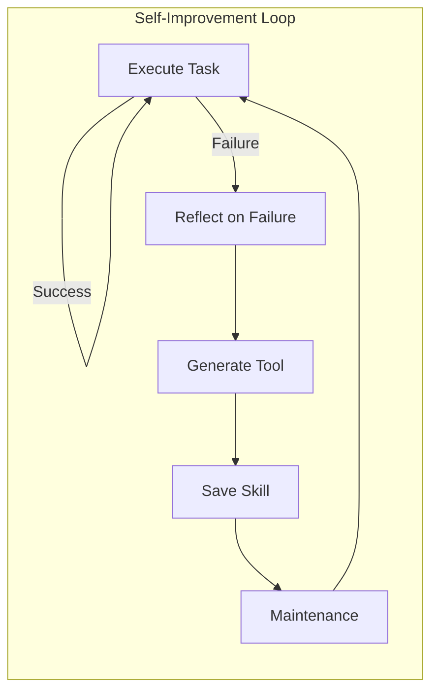

# bmo-agent

**Repository:** [github.com/joelhans/bmo-agent](https://github.com/joelhans/bmo-agent)
**Stars:** 31 | **License:** MIT

## Overview

bmo is a self-improving AI coding agent that runs in your terminal. It uses LLM-powered tool execution to complete tasks, and autonomously builds new tools and skills when it encounters limitations. Features multi-provider LLM routing, sandboxed tool execution, session persistence with cost tracking, and a self-improvement loop driven by reflections and periodic maintenance.

## Key Features

- **Self-Improvement Loop:** Agent builds new tools and skills autonomously
- **Multi-Provider LLM Routing:** OpenAI, Anthropic, and more
- **Sandboxed Tool Execution:** Dynamic tools run in isolated subprocesses
- **Session Persistence:** Full conversation history saved and resumable
- **Cost Tracking:** Token usage and cost monitoring per session
- **Model Tiering:** Automatic escalation between coding and reasoning models
- **Reflection System:** Agent reflects on failures and improves

## Architecture

```
src/
├── main.ts           # Entry point
├── tui.ts            # Terminal UI
├── agent-loop.ts     # Streaming agent loop
├── llm.ts            # Multi-provider LLM client
├── tools.ts          # Tool registry
├── tool-loader.ts    # Dynamic tool loading
├── sandbox.ts        # Sandboxed execution
├── skills.ts         # Skill system
├── context.ts        # Context management
├── tiering.ts        # Model tiering
├── config.ts         # Configuration
├── session.ts        # Session persistence
└── prompt.ts         # System prompt assembly
```

## How Self-Improvement Works



1. **Task Execution:** Agent attempts a task with tools
2. **Reflection:** On failure, agent reflects on what went wrong
3. **Tool Generation:** Agent generates new tools to handle similar tasks
4. **Skill Learning:** Agent creates reusable skills from experience
5. **Maintenance:** Periodic maintenance pass optimizes tools and skills

## Installation

```bash
git clone https://github.com/joelhans/bmo-agent.git
cd bmo-agent
bun install
bun run build
bun run install
```

## Usage

```bash
# Run bmo
bmo

# Add API key
bmo key add openai <your-key>

# Resume a session
bmo --session <id>

# Force maintenance
bmo --maintain
```

## Keybindings

| Key | Action |
|-----|--------|
| Enter | Submit message |
| Ctrl+C | Exit (triggers reflection) |
| F5 | Reload tools and skills |

## Relevance to Our Project

**Very high relevance** — This is exactly what we want: a self-improving coding agent. Key takeaways:
- Self-improvement loop architecture
- Tool generation from experience
- Reflection system for learning
- Model tiering for cost optimization

## Pros & Cons

| Pros | Cons |
|------|------|
| True self-improvement | Requires Bun runtime |
| Clean architecture | Limited to terminal UI |
| Session persistence | No web dashboard |
| Cost tracking | Smaller community |

## Running This Repo

```bash
cd cloned-repos/bmo-agent
bun install
bun run build
bmo key add openai <your-key>
bmo
```
