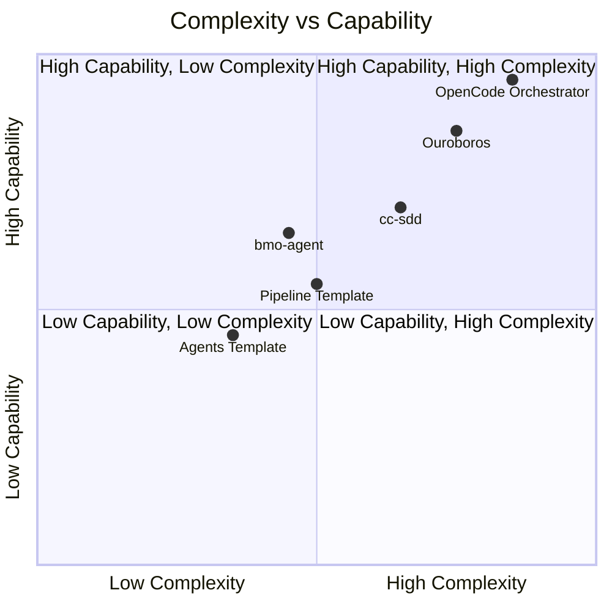
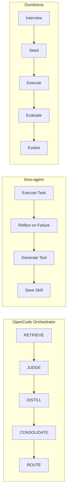

# Comparison: All Repos Analyzed

## Overview

| Repo | Focus | Self-Improvement | OpenCode Integration | Maturity |
|------|-------|------------------|---------------------|----------|
| **OpenCode Orchestrator** | Enterprise orchestration | ✓ Self-learning loop | ✓ Native | Active |
| **bmo-agent** | Self-improving terminal agent | ✓ Tool generation | ✗ Standalone | Stable |
| **OpenCode Pipeline Template** | Pipeline patterns | ✗ | ✓ Native | Stable |
| **Ouroboros** | Agent OS | ✓ Evolutionary loops | ✓ Multi-runtime | Active |
| **cc-sdd** | Spec-driven development | ✗ | ✓ Native | Stable |
| **OpenCode Agents Template** | Agent structuring | ✗ | ✓ Native | Stable |
| **Awesome Self-Evolving Agents** | Research compilation | N/A | N/A | Reference |

## Feature Comparison

### Self-Improvement Capabilities

| Repo | Mechanism | Level | Safety |
|------|-----------|-------|--------|
| **OpenCode Orchestrator** | Q-Learning, SONA | Agent routing | Consensus protocols |
| **bmo-agent** | Reflection + tool generation | Tools/Skills | Sandbox isolation |
| **Ouroboros** | Evolutionary loops | Specs/Execution | Policy boundaries |
| **cc-sdd** | Auto-debug on failure | Task-level | Independent review |

### Orchestration Patterns

| Repo | Pattern | Agents | Coordination |
|------|---------|--------|--------------|
| **OpenCode Orchestrator** | Swarm (mesh/hier/ring/star) | 60+ | Raft/BFT/Gossip/CRDT |
| **bmo-agent** | Single agent | 1 | N/A |
| **OpenCode Pipeline Template** | Pipeline (skill→subagent→command) | 10 | Sequential |
| **Ouroboros** | Interview→Seed→Execute→Evaluate | 10+ | Evolutionary |
| **cc-sdd** | Spec-driven (discovery→impl) | 17 skills | Per-task subagent |
| **OpenCode Agents Template** | Ticket-driven (GitHub Issues) | 3 categories | Issue-based |

### OpenCode Integration

| Repo | Integration Level | Commands | Skills |
|------|-------------------|----------|--------|
| **OpenCode Orchestrator** | Native CLI/MCP | ✓ | ✓ |
| **bmo-agent** | Standalone | ✗ | ✗ |
| **OpenCode Pipeline Template** | Native subagents | ✓ | ✓ |
| **Ouroboros** | Multi-runtime | ✓ | ✓ |
| **cc-sdd** | Native skills | ✓ | ✓ |
| **OpenCode Agents Template** | Native agents | ✓ | ✗ |

## Best For Use Cases

| Use Case | Best Repo | Why |
|----------|-----------|-----|
| **Enterprise multi-agent** | OpenCode Orchestrator | 60+ agents, swarm coordination, consensus |
| **Self-improving agent** | bmo-agent | True self-improvement loop |
| **Pipeline patterns** | OpenCode Pipeline Template | Clean three-layer separation |
| **Spec-driven development** | cc-sdd | 17 skills, 8 agent support |
| **Agent structuring** | OpenCode Agents Template | Clean taxonomy, ticket-driven |
| **Research reference** | Awesome Self-Evolving Agents | 90+ papers, safety section |
| **Agent OS** | Ouroboros | Most sophisticated architecture |

## Complexity vs Capability

## Orchestration Patterns Comparison

## Self-Improvement Mechanisms

## Recommendation for Our Project

### Primary: OpenCode Orchestrator + bmo-agent

**Why:**
1. **OpenCode Orchestrator** provides enterprise-grade orchestration with 60+ agents
2. **bmo-agent** provides the self-improvement loop we need
3. Combine both for a self-improving multi-agent system

### Secondary: cc-sdd + OpenCode Pipeline Template

**Why:**
1. **cc-sdd** provides spec-driven development patterns
2. **Pipeline Template** provides clean pipeline patterns
3. Both work natively with OpenCode

### Reference: Awesome Self-Evolving Agents + Ouroboros

**Why:**
1. **Awesome Self-Evolving Agents** is the comprehensive research reference
2. **Ouroboros** shows the most sophisticated Agent OS architecture
3. Both provide inspiration for advanced features

## Implementation Plan

1. **Phase 1:** Set up OpenCode Orchestrator with basic agent swarm
2. **Phase 2:** Integrate bmo-agent's self-improvement loop
3. **Phase 3:** Add cc-sdd's spec-driven patterns
4. **Phase 4:** Implement Pipeline Template's three-layer separation
5. **Phase 5:** Add Ouroboros's evolutionary loops
6. **Phase 6:** Reference Awesome Self-Evolving Agents for safety

## Key Takeaways

1. **Self-improvement is real** — bmo-agent and Ouroboros prove it works
2. **Spec-driven is mature** — cc-sdd shows how to do it properly
3. **Orchestration matters** — OpenCode Orchestrator shows enterprise patterns
4. **Safety is critical** — Awesome Self-Evolving Agents warns about misevolution
5. **OpenCode is the platform** — Most repos integrate with it natively
