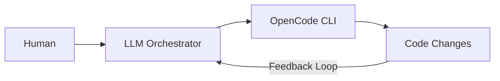
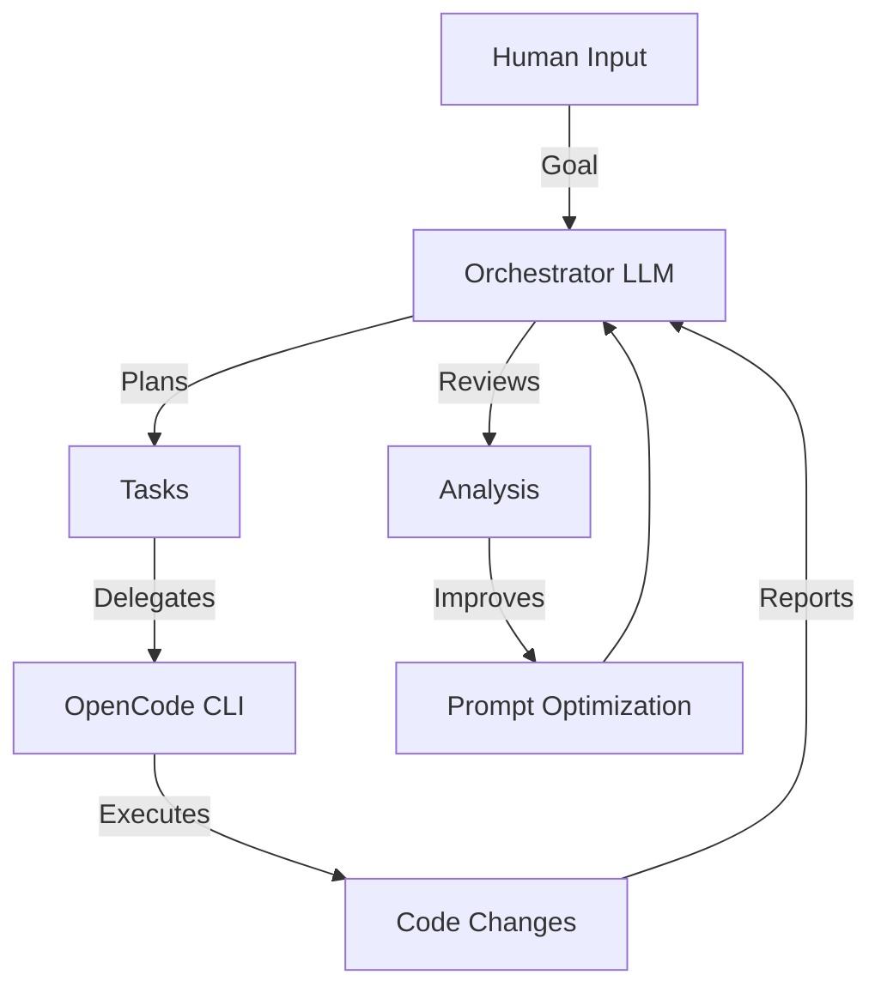
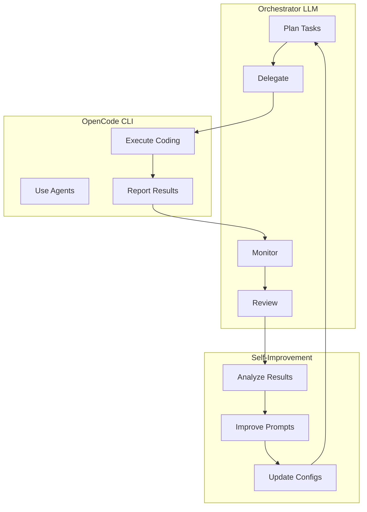

# Using an LLM to Control OpenCode

## Overview

This page documents how to use an LLM (like Hermes Agent, Claude Code, or Codex CLI) to control OpenCode as an autonomous coding worker. This is the key to building a never-stopping LLM-controlled coding pipeline.

## The Vision



An LLM orchestrates OpenCode to:
1. Plan tasks
2. Delegate to OpenCode
3. Monitor progress
4. Review results
5. Iterate until done

## Method 1: Hermes Agent + OpenCode Skill (Recommended)

### What is Hermes Agent?

Hermes Agent is an autonomous AI agent framework by Nous Research. It has a built-in **OpenCode skill** that teaches it to control OpenCode via CLI commands.

### Installation

```bash
# Install Hermes Agent
pip install hermes-agent

# Install OpenCode (if not already installed)
npm i -g opencode-ai@latest
```

### How It Works

Hermes Agent uses the `terminal()` tool to run OpenCode CLI commands:

```python
# One-shot task
terminal(command="opencode run 'Add retry logic to API calls'")

# Attach files
terminal(command="opencode run 'Review this config' -f config.yaml")

# Show thinking
terminal(command="opencode run 'Debug why tests fail' --thinking")

# Force specific model
terminal(command="opencode run 'Refactor auth' --model openrouter/anthropic/claude-sonnet-4")
```

### Interactive Sessions

```python
# Start background session
terminal(command="opencode", workdir="~/project", background=true, pty=true)
# Returns session_id

# Send prompts
process(action="submit", session_id="<id>", data="Implement OAuth flow")

# Monitor progress
process(action="poll", session_id="<id>")
process(action="log", session_id="<id>")

# Exit
process(action="write", session_id="<id>", data="\x03")
```

### Key Flags

| Flag | Use |
|------|-----|
| `run 'prompt'` | One-shot execution and exit |
| `--continue` / `-c` | Continue the last session |
| `--session <id>` / `-s` | Continue a specific session |
| `--model provider/model` | Force specific model |
| `--format json` | Machine-readable output |
| `--file <path>` / `-f` | Attach file(s) |
| `--thinking` | Show model thinking |

## Method 2: HermesOC (Embedded Plugin)

### What is HermesOC?

HermesOC is a plugin that embeds an OpenCode-style coding agent directly into Hermes. No external OpenCode CLI required.

### Installation

```bash
git clone https://github.com/evangit2/hermes-opencode.git
cd hermes-opencode
pip install -e .
```

### How It Differs

| Aspect | OpenCode Skill (upstream) | HermesOC (plugin) |
|--------|--------------------------|-------------------|
| **What it is** | Skill document (instructions) | Plugin with embedded engine |
| **Requires OpenCode CLI** | Yes | No |
| **Requires Node.js** | Yes | No |
| **How coding is triggered** | `terminal("opencode run '...'")` | `opencode_code()` tool |

## Method 3: Autonomous Dev Team

### What is it?

A fully automated development pipeline that turns issues into merged pull requests with zero human intervention. Supports OpenCode as one of its agent CLIs.

### Installation

```bash
npx skills add zxkane/autonomous-dev-team
```

### How It Works

1. **Dispatcher** scans for issues labeled `autonomous`
2. **Dev Agent** implements the feature in an isolated worktree
3. **Review Agent** reviews the code with optional E2E verification
4. Auto-merge when all checks pass

### Supported Agent CLIs

- Claude Code
- Codex CLI
- Kiro CLI
- **OpenCode**
- Cursor Agent
- Antigravity CLI

## Method 4: Claude Code → OpenCode Bridge

### What is it?

Running OpenCode inside an autonomous Claude Code AI Agent. Claude Code orchestrates OpenCode for benchmarking and automation.

### How It Works

```bash
# Claude Code runs OpenCode via CLI
claude run opencode run 'Generate a retro arcade game in HTML' --model opencode/big-pickle
```

### Use Case

Automate benchmarking multiple LLMs by running the same prompt through different models via OpenCode.

## Method 5: OpenCode CLI Direct Control

### What is it?

Using OpenCode's own CLI for automation without external orchestration.

### Installation

```bash
curl -fsSL https://opencode.ai/install | bash
```

### One-Shot Automation

```bash
# Simple task
opencode run 'Add retry logic to API calls'

# With file context
opencode run 'Review this config for security issues' -f config.yaml

# With thinking
opencode run 'Debug why tests fail in CI' --thinking

# Force model
opencode run 'Refactor auth module' --model openrouter/anthropic/claude-sonnet-4
```

### Programmatic Control

```python
import subprocess
import json

result = subprocess.run(
    ["opencode", "run", "--format", "json", "--thinking",
     "--model", "opencode/deepseek-v4-flash-free", prompt],
    capture_output=True, text=True, timeout=120,
    env={**os.environ, "OPENCODE_NO_TUI": "1"}
)

# Parse NDJSON events
texts = [
    obj["part"]["text"]
    for line in result.stdout.split("\n")
    if line.strip()
    if (obj := json.loads(line)).get("type") == "text"
]
response = "".join(texts)
```

## Comparison: Methods

| Method | External Agent | Complexity | Best For |
|--------|---------------|------------|----------|
| **Hermes Agent** | Hermes | Medium | Full orchestration |
| **HermesOC** | Hermes | Low | Embedded coding |
| **Autonomous Dev Team** | Any CLI | High | Issue→PR automation |
| **Claude Code Bridge** | Claude Code | Medium | Benchmarking |
| **OpenCode CLI Direct** | None | Low | Simple automation |

## Recommended Architecture

For our "LLM controls OpenCode" vision:





## Quick Start

```bash
# 1. Install Hermes Agent
pip install hermes-agent

# 2. Install OpenCode
npm i -g opencode-ai@latest

# 3. Configure OpenCode
opencode auth login

# 4. Run Hermes with OpenCode skill
hermes chat --skill opencode

# 5. Give it a task
> Implement a REST API with authentication and tests
```

## Key Takeaways

1. **Hermes Agent is the best orchestrator** — It has built-in OpenCode skill
2. **OpenCode CLI is the execution engine** — It does the actual coding
3. **The feedback loop is critical** — Orchestrator monitors and reviews
4. **Self-improvement comes from analysis** — Analyze results to improve prompts
5. **Start simple, iterate** — Begin with one-shot tasks, then build loops
