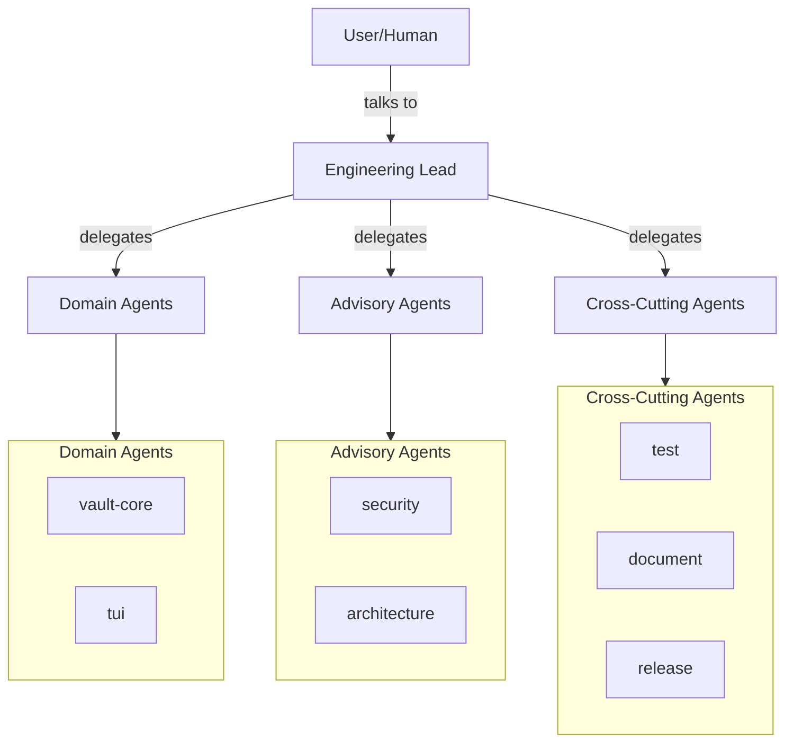

# OpenCode Agents Template

**Repository:** [github.com/rmkohlman/opencode-agents](https://github.com/rmkohlman/opencode-agents)
**Stars:** 3

## Overview

A template repo and reference guide for building AI agent systems with OpenCode. Learn how to structure multi-agent teams that plan, implement, test, document, and ship software — entirely through GitHub Issues.

## Key Features

- **Agent Categories:** Domain, Advisory, Cross-cutting
- **Ticket-Driven Workflow:** No Ticket, No Work
- **GitHub Issues as Source of Truth:** All communication through issues
- **Primary Orchestrator:** Engineering Lead delegates everything
- **Persistent Agents:** Long-running collaborators with defined responsibilities

## Architecture



## Agent Types

| Category | Description | Examples |
|----------|-------------|---------|
| **Domain** | Own specific directories. Full read/write/bash access. | `@vault-core`, `@tui` |
| **Advisory** | Read-only reviewers. Never modify code. | `@security`, `@architecture` |
| **Cross-cutting** | Handle concerns that span all domains. | `@test`, `@document`, `@release` |

## Directory Structure

```
your-repo/
├── CLAUDE.md                    # Project context for every agent
├── .opencode/
│   ├── agents/                  # Agent definitions
│   │   ├── engineering-lead.md  # Primary orchestrator
│   │   ├── vault-core.md        # Domain agent
│   │   ├── security.md          # Advisory agent
│   │   ├── test.md              # Cross-cutting agent
│   │   ├── document.md          # Cross-cutting agent
│   │   └── release.md           # Cross-cutting agent
│   └── commands/                # Custom slash commands
```

## Installation

```bash
git clone https://github.com/rmkohlman/opencode-agents.git
cd opencode-agents
# Copy .opencode/ to your project
```

## Relevance to Our Project

**High relevance** — This shows how to structure multi-agent teams with OpenCode. Key takeaways:
- Agent category taxonomy (Domain, Advisory, Cross-cutting)
- Ticket-driven workflow
- GitHub Issues as communication channel
- Primary orchestrator pattern

## Pros & Cons

| Pros | Cons |
|------|------|
| Clean agent taxonomy | Requires GitHub Issues |
| Ticket-driven workflow | Template only (not a framework) |
| Production patterns | Limited to OpenCode |
| Good documentation | Smaller community |

## Running This Repo

```bash
cd cloned-repos/opencode-agents
# Copy .opencode/ to your project
# Configure agents for your use case
# Use in OpenCode
```
