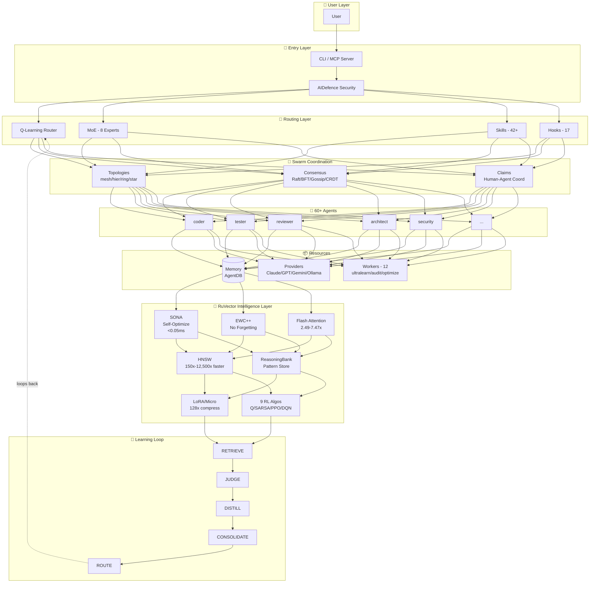
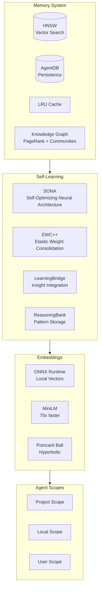
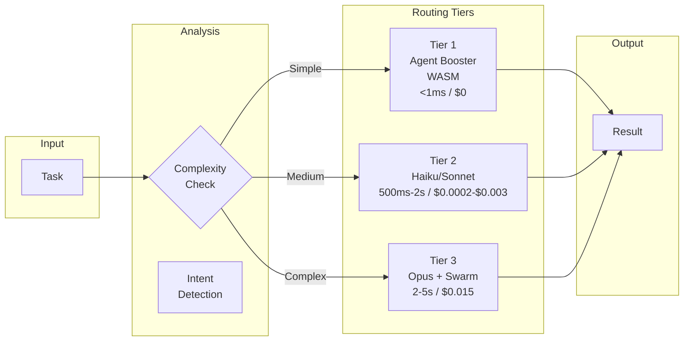
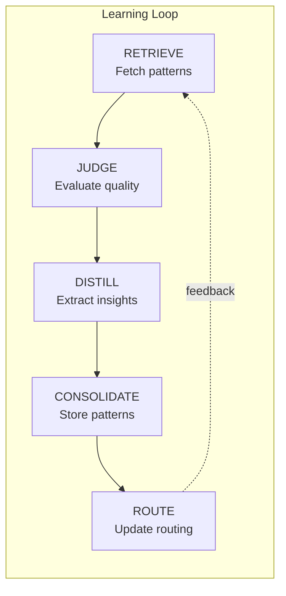
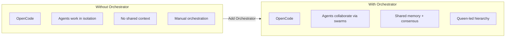

# OpenCode Orchestrator — Deep Analysis

**Repository:** [github.com/cloudpftc/opencode-orchestrator](https://github.com/cloudpftc/opencode-orchestrator)
**Version:** 3.6.0 | **License:** MIT | **Language:** TypeScript

## Executive Summary

OpenCode Orchestrator is the most comprehensive AI agent orchestration platform for OpenCode. It deploys **60+ specialized agents** in coordinated swarms with self-learning capabilities, fault-tolerant consensus, and enterprise-grade security.

## Architecture Overview



## Core Components

### 1. Swarm Coordination

```mermaid
graph LR
    subgraph TOPOLOGIES["Swarm Topologies"]
        MESH[mesh<br/>peer-to-peer]
        HIER[hierarchical<br/>queen/workers]
        RING[ring<br/>token passing]
        STAR[star<br/>central hub]
    end

    subgraph CONSENSUS["Consensus Protocols"]
        RAFT[Raft<br/>leader election]
        BFT[Byzantine<br/>f < n/3 faults]
        GOSSIP[Gossip<br/>eventual consistency]
        CRDT[CRDT<br/>conflict-free]
        MAJORITY[Majority<br/>2/3 vote]
    end

    subgraph QUEENS["Queen Types"]
        STRAT[Strategic<br/>planning]
        TACT[Tactical<br/>execution]
        ADAPT[Adaptive<br/>optimization]
    end

    subgraph WORKERS["Worker Types"]
        W1[Researcher]
        W2[Coder]
        W3[Analyst]
        W4[Tester]
        W5[Architect]
        W6[Reviewer]
        W7[Optimizer]
        W8[Documenter]
    end

    TOPOLOGIES --> CONSENSUS
    CONSENSUS --> QUEENS
    QUEENS --> WORKERS
```



### 2. Intelligence & Memory



### 3. Task Routing



### 4. Learning Loop



## Directory Structure

```
opencode-orchestrator/
├── .agents/                    # Agent definitions (YAML)
├── .opencode/                  # OpenCode configuration
├── .opencode-flow/             # Flow configuration
├── agents/                     # Agent implementations
│   ├── architect.yaml
│   ├── coder.yaml
│   ├── reviewer.yaml
│   ├── security-architect.yaml
│   └── tester.yaml
├── bin/                        # CLI entry points
├── plugin/                     # Plugin system
├── scripts/                    # Automation scripts
├── tests/                      # Test suite
├── v2/                         # Version 2 code
├── v3/                         # Version 3 code (current)
│   └── @claude-flow/
│       ├── cli/                # CLI implementation
│       ├── shared/             # Shared utilities
│       └── guidance/           # Guidance system
├── opencode.json               # OpenCode configuration
├── package.json                # Node.js dependencies
└── README.md                   # Documentation (7393 lines)
```

## Key Features

### 1. 60+ Specialized Agents

| Category | Agents | Purpose |
|----------|--------|---------|
| **Coding** | coder, frontend-specialist, backend-specialist | Code generation |
| **Testing** | tester, security-auditor | Quality assurance |
| **Review** | reviewer, architect | Code review |
| **Security** | security-architect, auditor | Security analysis |
| **DevOps** | devops, deployment | Infrastructure |
| **Documentation** | documenter, technical-writer | Documentation |

### 2. Swarm Topologies

| Topology | Use Case | Coordination |
|----------|----------|--------------|
| **Mesh** | Peer-to-peer collaboration | Direct communication |
| **Hierarchical** | Queen-led coordination | Queen → Workers |
| **Ring** | Token passing | Sequential processing |
| **Star** | Central hub | Hub → Spokes |

### 3. Consensus Protocols

| Protocol | Fault Tolerance | Use Case |
|----------|-----------------|----------|
| **Raft** | Leader election | Single leader coordination |
| **Byzantine** | f < n/3 | Untrusted agents |
| **Gossip** | Eventual consistency | Information spread |
| **CRDT** | Conflict-free | Parallel edits |
| **Majority** | 2/3 vote | Simple decisions |

### 4. RuVector Intelligence

| Component | Purpose | Performance |
|-----------|---------|-------------|
| **SONA** | Self-Optimizing Neural Architecture | <0.05ms adaptation |
| **EWC++** | Prevents catastrophic forgetting | Preserves patterns |
| **Flash Attention** | Optimized attention | 2.49-7.47x speedup |
| **HNSW** | Vector search | 150x-12,500x faster |
| **ReasoningBank** | Pattern storage | RETRIEVE→JUDGE→DISTILL |
| **LoRA** | Low-Rank Adaptation | 128x compression |
| **9 RL Algorithms** | Q-Learning, SARSA, PPO, DQN | Task-specific learning |

## Installation

```bash
# One-line install
npm install -g @cloudpftc/opencode-orchestrator@latest

# Or use npx
npx @cloudpftc/opencode-orchestrator@latest init

# Add as MCP server to OpenCode
opencode mcp add cloudpftc-orchestrator "npx @cloudpftc/opencode-orchestrator@latest mcp serve"
```

## Usage

```bash
# Initialize project
npx opencode-orchestrator@latest init

# Start MCP server
npx opencode-orchestrator@latest mcp start

# Run a task with agents
npx opencode-orchestrator@latest --agent coder --task "Implement user authentication"

# List available agents
npx opencode-orchestrator@latest --list
```

## OpenCode Integration

### Before vs After



### MCP Tools Available

| Tool | Description |
|------|-------------|
| `swarm_init` | Initialize agent swarms |
| `agent_spawn` | Spawn specialized agents |
| `memory_search` | Search patterns with HNSW |
| `hooks_route` | Intelligent task routing |
| + 170 more | Full MCP tool suite |

## Performance Metrics

| Metric | Value |
|--------|-------|
| **Routing Accuracy** | 100% |
| **Routing Latency** | 0.57ms avg |
| **Token Savings** | 30-50% |
| **Agent Booster Speedup** | 352x faster |
| **API Cost Reduction** | 75% |
| **Claude Max Extension** | 2.5x |

## Comparison with Other Frameworks

| Feature | OpenCode Orchestrator | CrewAI | LangGraph | AutoGen |
|---------|----------------------|--------|-----------|---------|
| **Self-Learning** | ✅ SONA + EWC++ | ❌ | ❌ | ❌ |
| **Vector Memory** | ✅ HNSW | ❌ | Via plugins | ❌ |
| **Consensus** | ✅ 5 protocols | ❌ | ❌ | ❌ |
| **MCP Integration** | ✅ 170+ tools | ❌ | ❌ | ❌ |
| **Agent Booster** | ✅ WASM | ❌ | ❌ | ❌ |

## Relevance to Our Project

### What We Can Learn

1. **Swarm Coordination Patterns** — How to organize multiple agents
2. **Self-Learning Architecture** — SONA + EWC++ for continuous improvement
3. **Consensus Protocols** — Fault-tolerant decision making
4. **Memory System** — HNSW + Knowledge Graph + Agent Scopes
5. **Task Routing** — 3-tier routing for cost optimization
6. **MCP Integration** — Native OpenCode integration

### What We Can Use

1. **Agent Definitions** — YAML-based agent configuration
2. **Swarm Topologies** — Mesh, hierarchical, ring, star
3. **Consensus Algorithms** — Raft, Byzantine, Gossip
4. **Learning Loop** — RETRIEVE → JUDGE → DISTILL → CONSOLIDATE → ROUTE
5. **RuVector Intelligence** — SONA, EWC++, Flash Attention

### Implementation Plan

1. **Phase 1:** Install and test basic orchestration
2. **Phase 2:** Integrate swarm coordination
3. **Phase 3:** Add self-learning loop
4. **Phase 4:** Implement consensus protocols
5. **Phase 5:** Add RuVector intelligence

## Running This Repo

```bash
cd cloned-repos/opencode-orchestrator
npm install
npm run build
npx opencode-orchestrator@latest init
npx opencode-orchestrator@latest mcp start
```

## Key Takeaways

1. **Most comprehensive orchestration platform** — 60+ agents, 5 consensus protocols
2. **Self-learning is real** — SONA + EWC++ for continuous improvement
3. **Memory matters** — HNSW + Knowledge Graph + Agent Scopes
4. **Cost optimization** — 3-tier routing saves 75% on API costs
5. **OpenCode native** — 170+ MCP tools for seamless integration
