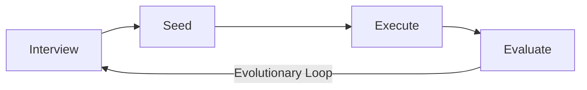

# Ouroboros

**Repository:** [github.com/Q00/ouroboros](https://github.com/Q00/ouroboros)
**License:** MIT

## Overview

Ouroboros is an **Agent OS** for AI coding: a local-first runtime layer that turns non-deterministic agent work into a replayable, observable, policy-bound execution contract. It replaces ad-hoc prompting with a structured specification-first workflow: interview, crystallize, execute, evaluate, evolve.

**"It gets smarter on its own. We just hold the line."**

## Key Features

- **Specification-First Workflow:** Interview → Seed → Execute → Evaluate
- **Socratic Clarity:** Question until ambiguity ≤ 0.2
- **Evolutionary Loops:** Each evaluation cycle feeds back into better specs
- **Multi-Runtime Support:** Claude Code, Codex CLI, OpenCode, Hermes, Gemini, Kiro, Copilot
- **MCP Integration:** Model Context Protocol for tool access
- **Replayable Execution:** Every action becomes a contract
- **Safety Boundaries:** Policy-bound execution

## The Ouroboros Stack

| Layer | Repo | Role |
|-------|------|------|
| **Shell** (terminal client) | `Ouro-labs/ourocode` | Native terminal UI |
| **Apps** (domain workflows) | `Ouro-labs/ouroboros-plugins` | UserLevel plugin contract |
| **OS** (this repo) | `Q00/ouroboros` | Agent OS core — Seed, Ledger, Runtime, MCP |

## How It Works



1. **Interview:** Socratic questioning to clarify requirements
2. **Seed:** Generate specification from clarified requirements
3. **Execute:** Run code generation with policy boundaries
4. **Evaluate:** Grade results and feed back into next iteration

## Installation

```bash
curl -fsSL https://raw.githubusercontent.com/Q00/ouroboros/main/scripts/install.sh | bash
```

## Usage

```bash
# Setup
ooo setup

# Start auto mode
ooo auto <task>

# Interview mode
ooo interview <idea>

# Seed architecture
ooo seed

# Execute
ooo run

# Evaluate
ooo evaluate

# Evolve
ooo evolve
```

## Agents

| Agent | Role |
|-------|------|
| `socratic-interviewer` | Clarifies requirements through questioning |
| `ontologist` | Defines precise specifications |
| `seed-architect` | Generates architecture from specs |
| `evaluator` | Grades execution results |
| `qa-judge` | Quality assurance |
| `contrarian` | Challenges assumptions |

## Relevance to Our Project

**Very high relevance** — This is the most sophisticated agent OS for coding. Key takeaways:
- Specification-first workflow
- Evolutionary improvement loops
- Multi-runtime support
- Safety and policy boundaries

## Pros & Cons

| Pros | Cons |
|------|------|
| Sophisticated architecture | Complex setup |
| Multi-runtime support | Requires understanding of Agent OS concept |
| Evolutionary improvement | Large codebase |
| Safety boundaries | Active development |

## Running This Repo

```bash
cd cloned-repos/ouroboros
pip install -e .
ooo setup
ooo auto "Create a simple REST API"
```
